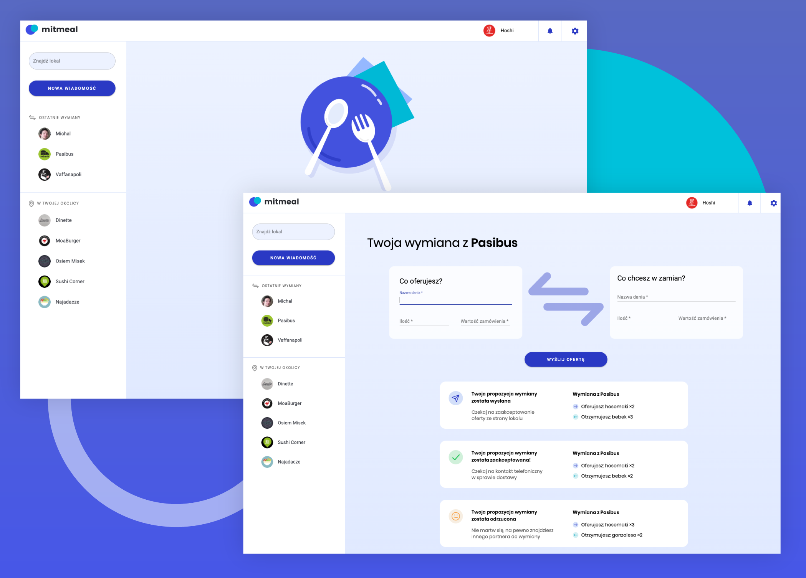

# Mitmeal

Mitmeal is a web app for restaurant workers. When you are bored with your everyday lunch at work, you can exchange your employee meal with people from other restaurants in the app.

## Take a look at my app [here](https://jdzianok.github.io/chery/)

## How to use

It's an exchange app so it works the best with two different users logged in at the same time. To check out the app:

1. Register as a new user

or

use an already existing profile and log in with this credentials (recommended):

- user: pasibus@pasibus.pl
- password: reactapp

- user: hoshi@hoshi.pl
- password: reactapp

- user: vaffanapoli@vaffanapoli.pl
- password: reactapp

2. Pick your friend from the chat list on the left, fill the exchange form and send your request.

If you are a new user, there are no friends on the sidebar. You have to create another account, then use "New message" button and type the exact e-mail address of your "friend". You can also use e-mail addresses from above.

3. If you are a sender, wait for your friend decision (the request has status "pending").

4. If you are a receiver, accept or reject the request.

## Preview

## The app offers basic functionalities

- sign in and sign up (firebase)
- displaying list of friends (other users)
- notification for new request
- exchange form (connected with firebase)
- choice of acceptance or rejection of the request
- displaing result
- order hostory

- no RWD (only desktop)

## Available Scripts

App was created with `create-react-app`

In the project directory, you can run:

### `npm start`

Runs the app in the development mode. 
Open [http://localhost:3000](http://localhost:3000) to view it in the browser.

The page will reload if you make edits. 
You will also see any lint errors in the console.

### `npm test`

Launches the test runner in the interactive watch mode. 
See the section about [running tests](https://facebook.github.io/create-react-app/docs/running-tests) for more information.

### `npm run build`

Builds the app for production to the `build` folder. 
It correctly bundles React in production mode and optimizes the build for the best performance.
